<h1 align="center">VISWA</h1>
<h3 align="center">⚔️ Cybersecurity Engineer from India 💙</h3>

 

  

###

---

## 👾 About Me

> *Electronics & Communication Engineer turned full-stack Cybersecurity practitioner.*

- 🔭 Currently building **EDR / XDR detection pipelines** and end-to-end **observability stacks**
- 🔥 Core expertise — `Wazuh` · `Splunk` · `ZTNA` · `Windows AD` · `Fortigate`
- 🛡️ Serving **SMBs & Enterprises** as a security consultant — **4+ clients**
- 📊 Monitoring **1000+ endpoints** via SOCFortress CoPilot (**14 connectors**)
- 🏅 Holding **10+ active certifications** across security, cloud & networking
- 💬 Ask me about **Bug Bounty · Penetration Testing · SIEM Engineering**
- 📝 Read my [Cyber Creed](VISWA) · Watch the [Live Cyber Map](https://cybermap.kaspersky.com/en/widget/dynamic/dark)
- ⚡ Fun fact: **Hack → Code → Repeat**

---

## 🏆 Quick Stats

| 🔢 Stat | 💥 Value |
|---|---|
| 🏅 Certifications | **10+** active |
| ☁️ Cloud Platforms | **3** (Azure · AWS · GCP) |
| 🖥️ Monitored Endpoints | **1000+** |
| 🔌 SOC Connectors | **14** (CoPilot) |
| 🐧 Attack OS | **Kali Linux** |
| 💻 Primary Machine | **VISWA-SPACE** (Win 11) |
| 🤝 Clients | **4+** (SMBs & Enterprise) |

---

## 📊 GitHub Stats

---

## 🎓 Certifications

| Badge | Certification |
|---|---|
|  | Certified Ethical Hacker (CEH V13) |
|  | AWS Certified Cloud Practitioner |
|  | Microsoft Azure Fundamentals |
|  | Red Hat System Administration (RH124) |
|  | CISCO Cybersecurity Essentials |

*Internship Certificates: Cyber & Forensics Security Solutions · Prodigy InfoTech · EduSkills Foundation (Cloud)*

---

## 🛠️ Tech Arsenal

### 🔴 SIEM & Detection Engineering

### 🟠 SOAR & Threat Intelligence

### 🟡 Observability Stack

### 🟢 VAPT & Offensive Security

### 🔵 Cloud Security

### 🟣 Infrastructure & DevOps

### 🤖 AI & Productivity Tools

---

## 📅 GitHub Calendar

## 🐍 Snake eating GitHub contributions

---

## 📈 Activity Graph

---

## 🤝 Support

---

  

<i>"The quieter you become, the more you are able to hear." — Kali Linux</i>

